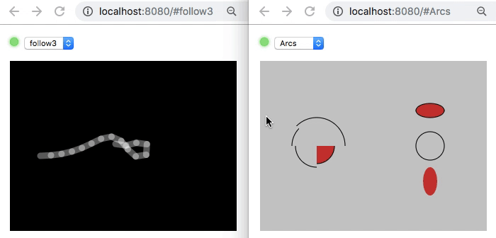

[](https://circleci.com/gh/groove-x/pura)

# pura - the little async embedded visualization framework that could

Pura is a framework enabling remote, always-available graphical and command
line views for developers to understand, inspect, and modify their
async app while it's running.

During development, it's productive to have visualizations that let
you see and alter the internal state of your program.  Pura lets
you create these easily alongside your regular code, and view them
remotely from a web browser.  This is especially handy for apps that
don't otherwise have a GUI, or run on a device lacking a display.

Visualizations:
 * apps can register one or more animated graphical views
 * views are coded using a subset of the [Processing API](https://py.processing.org/reference/)
 * views can be observed over HTTP by one or more browser clients
 * views have no overhead unless there is a remote client specifically observing it
 * keyboard and mouse input is supported

Read-eval-print loop:
 * apps can register a REPL exposing a specific namespace
 * REPL instances can be created remotely over HTTP by one or more browser clients
 * the REPL is available while your program is running
 * tab completion is supported

The example in action:



## Installation

```shell
git clone https://github.com/groove-x/pura.git
cd pura
pip install -e .
```

If you use Trio rather than asyncio:
```shell
pip install -e .[trio]
```

## Run the examples

```
python examples/web_view_example.py
```
Then connect at http://localhost:8080/

```
python examples/web_repl_example.py
```
Then connect at http://localhost:8080/repl

The examples use asyncio by default.  For Trio, use `--async-backend trio`.

## Using pura in your own project

Pura requires that your program be fully async (either asyncio or Trio).
In other words, the main thread should not be blocked by I/O or computation for
any length of time.

Add visualizations to your program by inheriting from `WebViewMixin`
and implementing the `draw()` method.

At the top level of your program, launch the web view server and
register your class instances.

```python
import asyncio
from pura import WebViewMixin, WebViewServer

class Foo(WebViewMixin):
    def __init__(self):
        super().__init__(webview_size=(320, 240))

    def draw(self, ctx):
        ctx.background(0)
        ctx.line(0, 0, ctx.width, ctx.height)
        ...

...

foo = Foo()
server = WebViewServer()
await asyncio.gather(
    server.serve("Web view server", 'localhost', 8080),
    foo.webview.serve(server))
```

See the project [`examples/`](examples/) directory, as well as help
documentation on the `pura` package and individual classes.

## Disclaimer

Pura is intended to be used over a
trusted network to visualize and alter the internal state of a program
during development.  The web client is implemented via eval of
JavaScript received over HTTP from the server.

This software is not supported by GROOVE X, Inc., and GROOVE X
specifically disclaims all warranties as to its quality,
merchantability, or fitness for a particular purpose.
